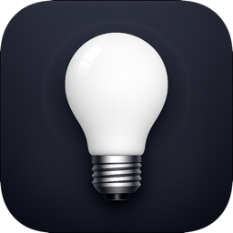

  

<h1 align="center">Lucis</h1>

  <strong>WiFi LED Controller for macOS</strong> 
  Control your LED strips from the menu bar — no phone needed.

  
  
  

---

Lucis is a native macOS utility that lets you control WiFi LED strips directly from your menu bar. Adjust colors, brightness, effects, and schedules with a single click or a keyboard shortcut. All communication stays local on your network — no cloud, no accounts, no tracking.

## Features

- **One-click control** — Turn lights on/off from the menu bar or with a custom keyboard shortcut
- **Colors & brightness** — 10 presets, a full custom color picker, and an intuitive brightness slider
- **Effects** — Rainbow, gradient, strobe, breathing, and color jump with adjustable speed
- **Scenes** — Save and instantly recall your favorite light configurations
- **Scheduled timers** — Automate on/off times with weekday repeat
- **System triggers** — Lights react when your Mac sleeps, wakes, shuts down, or the display turns on/off
- **Multiple devices** — Discover and control several LED strips from one app
- **100% local** — No cloud, no sign-up, no data collection

## Compatibility

Lucis works with any WiFi LED controller that uses the LEDENET protocol, including:

- Magic Home
- MagicHue
- LEDENET
- Flux LED

> If your controller connects via the Magic Home app on iOS/Android, it will work with Lucis.

## Download

  

## Website

Visit the official site for more details:
**[mlopezaragon.github.io/lucis-site](https://mlopezaragon.github.io/lucis-site/)**

## Support

Having issues or questions? Check the support page:
**[Support & Contact](https://mlopezaragon.github.io/lucis-site/support.html)**

You can also reach us at **soporte@utilia.ai**.

## Privacy

Lucis does not collect, store, or transmit any personal data. All communication happens locally between your Mac and your LED controllers.
Read the full policy: **[Privacy Policy](https://mlopezaragon.github.io/lucis-site/privacy.html)**

---

  &copy; UTILIA SERVICIOS IA S.COOP.CAN

